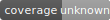

dsge
====

A simple Python (3+) package for Dynamic Stochastic General Equilibrium (DSGE) models.

This was originally forked from Pablo Winant's (excellent) package
dolo.  (See [https://github.com/EconForge/dolo].)  I wrote this mainly
for my own personal use; as such it may contain bugs, and the
documentation might be lacking in some (many) places.

Installation
------------

- From PyPI (if published):
  - `pip install dsge`
  - `uv pip install dsge`
  - `poetry add dsge`

- From source (this repository):
  - Using uv (recommended for dev): `uv pip install -e .`
  - Using pip: `pip install -e .`
  - Using Poetry (no Poetry metadata required):
    - `poetry shell` then `pip install -e '.[test]'` (installs package + test extras), or
    - `poetry run pip install -e '.[test]'`

Tests
-----

- Using uv (pytest): `uv run -m pytest -q dsge/tests`
- Using uv (unittest): `uv run python -m unittest discover -s dsge/tests -p 'test_*\.py'`
- Using Poetry (ensure test deps are installed first, e.g., `poetry run pip install -e '.[test]'`):
  - Pytest: `poetry run pytest -q dsge/tests`
  - Unittest: `poetry run python -m unittest discover -s dsge/tests -p 'test_*\.py'`

Quick Check
-----------

- Import check: `uv run python -c "import dsge; print(dsge.__file__)"`

Bugs and Questions
------------------
For bug reports and questions, send me an email at
ed.herbst@gmail.com.  If there is enough interest,
I'll mirror the source on github.

Documentation
--------------

Build and serve the MkDocs site locally using uv:

- Install docs tooling (one-time):
  - `uv pip install mkdocs mkdocs-material mkdocs-macros-plugin "mkdocstrings[python]"`
  - or `make docs-install`

- Serve with live reload:
  - `uv run mkdocs serve`
  - or `make docs-serve`

- Build static site (outputs to `site/`):
  - `uv run mkdocs build --strict`
  - or `make docs-build`

Docs entry points:
- Overview: `docs/index.md`
- Parsing DSL: `docs/parsing.md`
- Config: `mkdocs.yml`
